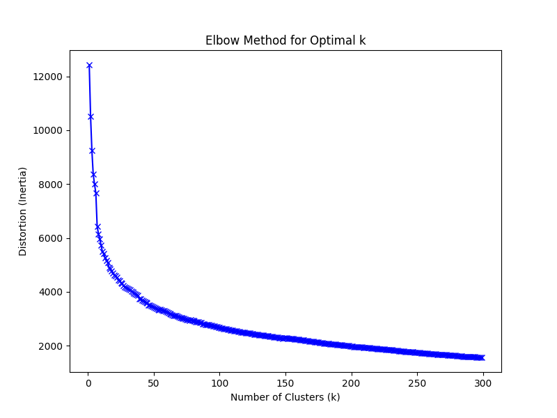
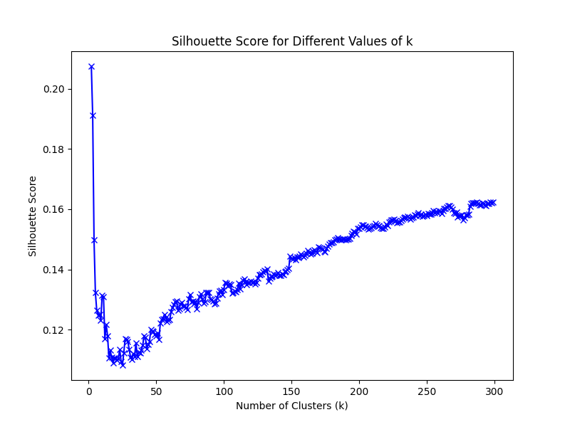
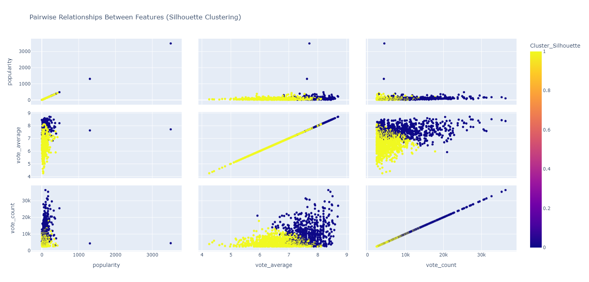
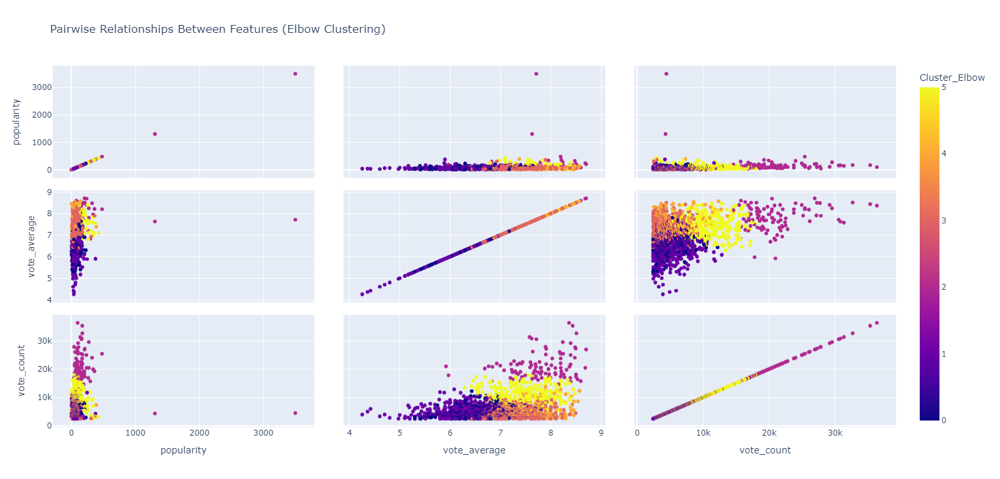
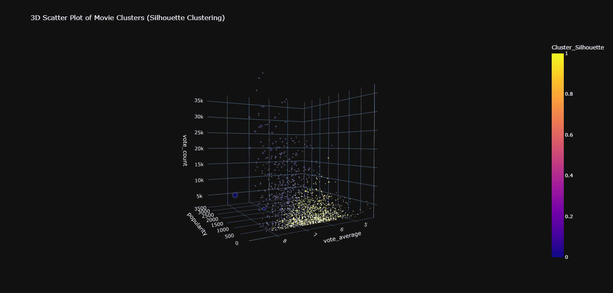
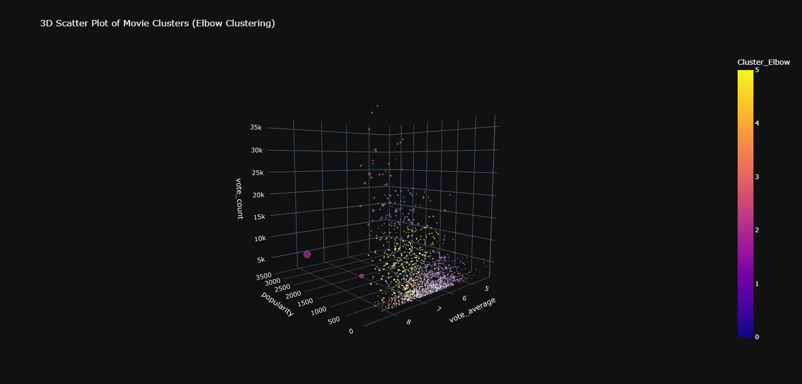
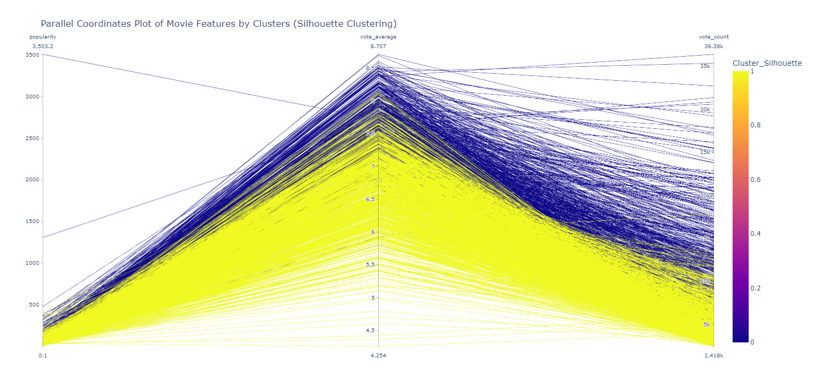
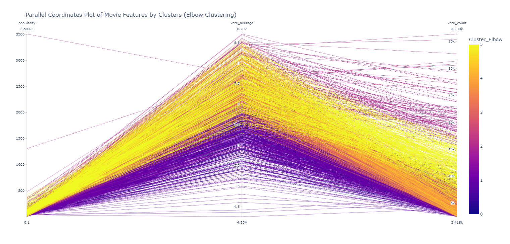
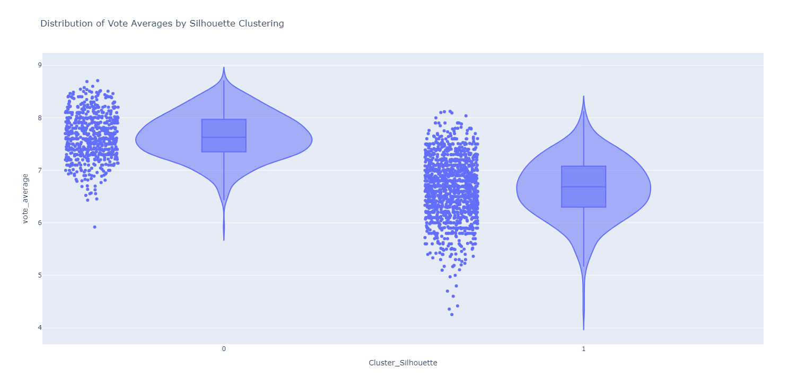
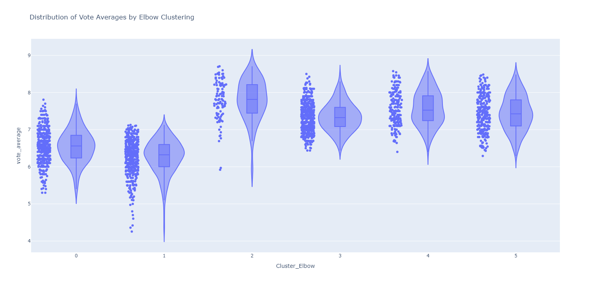

# 🎥 Movie Data Analysis Using K-Means Clustering

Welcome to my learning project! 🙌 In this repository, I explore how we can group movies into clusters based on their features like **popularity**, **vote average**, and **vote count**. Using **K-Means Clustering**, I aim to understand how movies can be categorized into meaningful groups. I applied two methods for optimizing clustering: the **Elbow Method** and the **Silhouette Score**.

This project helped me explore:
- How **clustering** can group movies based on similar attributes.
- How to visualize movie clusters and analyze feature relationships.
- How to evaluate clustering quality using **Elbow** and **Silhouette** methods.

---

## 📚 What is this project about?

This project is a deep dive into **movie data clustering**. I fetched movie data from the **TMDb API**, focusing on attributes like **popularity**, **vote average**, and **vote count**. I then applied **K-Means Clustering** to group movies based on these features.

The project allowed me to:
- Cluster movies using K-Means based on their features.
- Evaluate the quality of clusters using the **Elbow Method** and **Silhouette Score**.
- Visualize the clusters with various plots to understand patterns and relationships between movie features.

---

## 🛠️ How does it work?

### The Workflow:
1. **Data Collection**: I used the **TMDb API** to collect movie data, focusing on attributes like **popularity**, **vote average**, and **vote count**.
2. **Data Preprocessing**: I cleaned and normalized the data using `preprocessing.py`, preparing it for clustering.
3. **K-Means Clustering**: After pre-processing the data, I applied the **K-Means** algorithm to cluster movies. I used two methods to evaluate the clustering:
   - **Elbow Method** to determine the optimal number of clusters.
   - **Silhouette Score** to measure how well the clustering separates the data.
4. **Visualization**: I created various visualizations, including **pairwise plots**, **3D scatter plots**, and **violin plots**, to better understand the clusters and relationships between features.

### Files in the project:
- **`src/extract_data.py`**: Fetches movie data from the TMDb API.
- **`src/preprocessing.py`**: Prepares the movie data by cleaning and normalizing features.
- **`src/kmeans.py`**: Applies K-Means clustering to the preprocessed data.
- **`src/visualization.py`**: Generates multiple visualizations to analyze the clustering results.
- **`src/get_genres.py`**: Maps genre IDs to genre names using the TMDb API.
- **`requirements.txt`**: Lists all the required Python packages for running the project.

---

## 🚀 How to Run the Project

1. **Clone the repository**:
    ```bash
    git clone https://github.com/eduardorbl/Movie-data-analysis-TMDB.git
    cd Movie-data-analysis-TMDB
    ```

2. **Install dependencies**:
    Install the necessary Python packages by running:
    ```bash
    pip install -r requirements.txt
    ```

3. **Fetch Movie Data**:
    Use `src/extract_data.py` to fetch the movie data from the TMDb API:
    ```bash
    python ./src/extract_data.py
    ```

4. **Preprocess the Data**:
    Run `src/preprocessing.py` to clean and normalize the data:
    ```bash
    python ./src/preprocessing.py
    ```

5. **Apply K-Means Clustering**:
    Run `src/kmeans.py` to cluster the movies:
    ```bash
    python ./src/kmeans.py
    ```

6. **Generate Visualizations**:
    Finally, run `src/visualization.py` to create visualizations of the clusters:
    ```bash
    python ./src/visualization.py
    ```

---

## 🔍 Understanding the Results

### 1. Elbow Method for Optimal K

The **Elbow Method** helps identify the optimal number of clusters by plotting the sum of squared distances (inertia) between movies and their cluster centers. The "elbow" of the curve indicates the best number of clusters.

**Plot:**



---

### 2. Silhouette Score for Different K Values

The **Silhouette Score** evaluates how well movies are grouped into clusters. A higher silhouette score indicates better clustering, with values close to 1 being ideal.

**Plot:**



---

### 3. Pairwise Plot (Scatter Matrix)

This plot shows pairwise relationships between features (e.g., popularity, vote average, and vote count), color-coded by cluster. It helps to see how well-separated clusters are across different feature combinations.



---

### 4. 3D Scatter Plot

This interactive 3D scatter plot visualizes how movies are clustered based on **popularity**, **vote average**, and **vote count**. It helps to explore how well the clusters are separated when viewed in 3D space.



---

### 5. Parallel Coordinates Plot

This plot visualizes how each movie's features change across multiple dimensions (e.g., popularity, vote count, and vote average), color-coded by cluster. It's useful for seeing how clusters behave across many features.




---

### 6. Violin Plot

The violin plot shows the distribution of **vote averages** across clusters. It helps to analyze the spread and distribution of movies' ratings in each cluster.




---

## 🧠 What did I learn from this?

### Key Takeaways:
- **Clustering can reveal hidden patterns** in movie data. By grouping similar movies based on features like popularity and vote count, we can understand how movies relate to one another.
- **Visualizations help explain clusters**: Using scatter plots, parallel coordinates, and violin plots allowed me to explore how movies are distributed across clusters and how features interact.
- **Clustering methods are flexible**: The **Elbow Method** and **Silhouette Score** provided insights into how many clusters are most appropriate for the data.

### How is this useful?

Clustering can be extremely useful in the **movie industry**, where we can use it to:
- Group similar movies for recommendation systems.
- Understand how certain features (like popularity and vote average) define groups of movies.
- Analyze trends and patterns within the movie data to make data-driven decisions for marketing and content creation.

---

## 🎯 What’s next?

This project helped me understand clustering, but there’s always room to improve! My next steps:
- Experimenting with other clustering techniques like **DBSCAN** and **hierarchical clustering** to compare results.
- Exploring more features like **budget** and **runtime** to deepen the analysis.
- Creating a **web dashboard** using **Dash** to allow real-time interaction with the clustering data.

---

## 🤗 Final Thoughts

Thank you for taking the time to explore this project! 🙏 I’m continually learning and improving, and I’d love to hear your feedback or suggestions. Feel free to open an issue or reach out if you have any ideas on how to take this project further.

---

### Let’s connect!
[LinkedIn](https://www.linkedin.com/in/jos%C3%A9-eduardo-santos-rabelo-296239234/)
